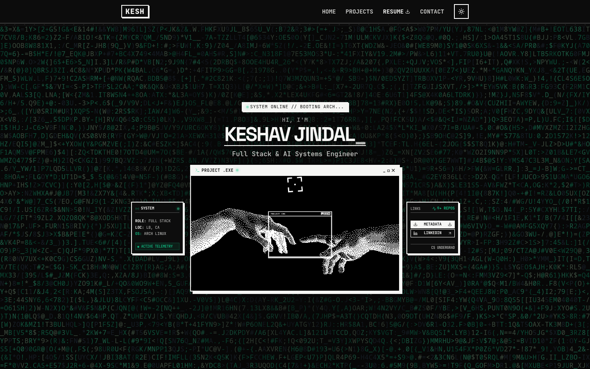
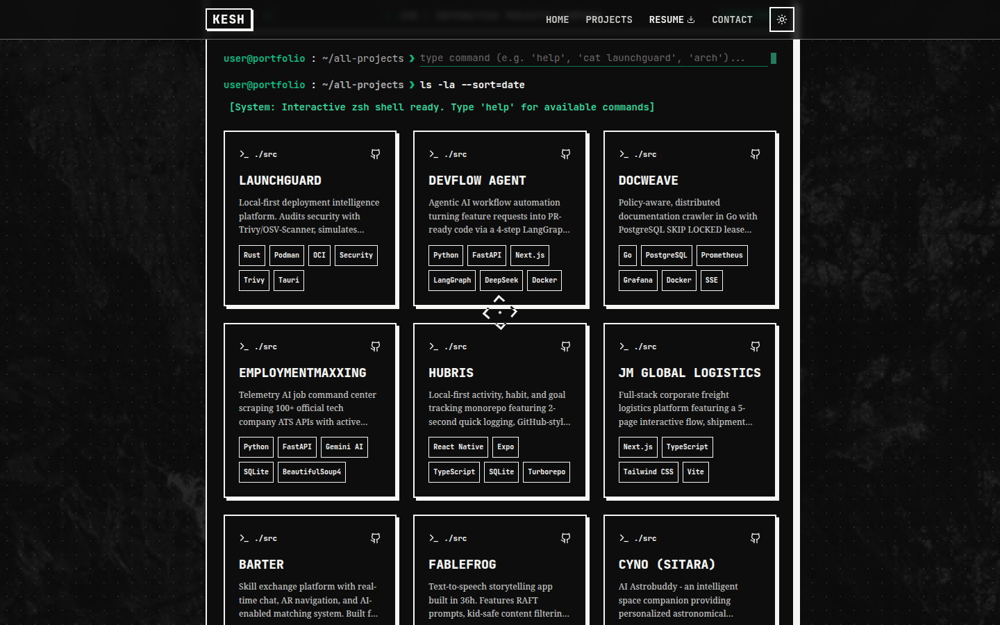
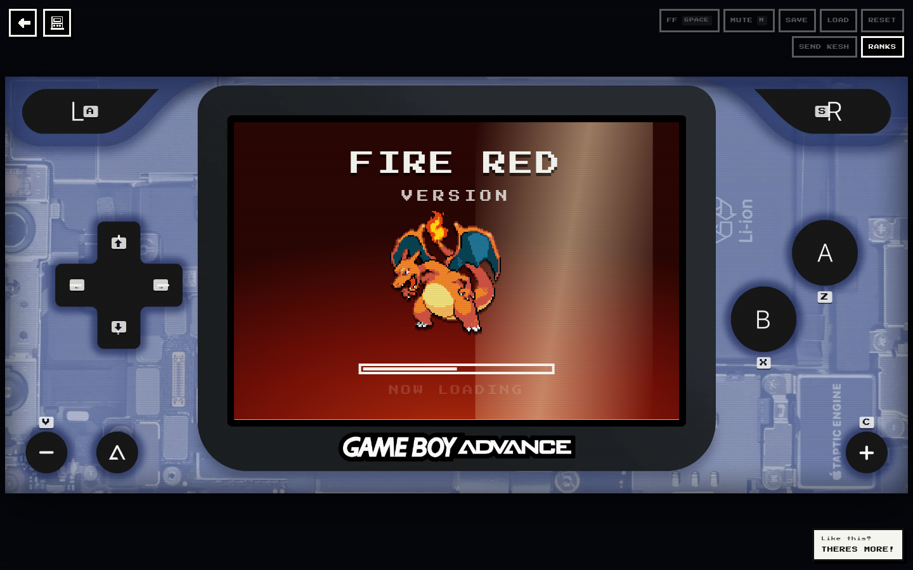
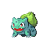
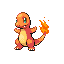
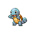
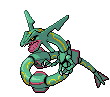
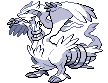
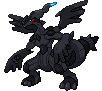
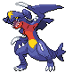

<div align="center">
  

  <h1>KESH // PORTFOLIO VERSION</h1>

  <p><strong>A full-stack developer portfolio with manga panels, terminal UI, and a complete Game Boy Advance hiding below the surface.</strong></p>

  <p>
    <a href="https://nextjs.org/"></a>
    <a href="https://www.typescriptlang.org/"></a>
    <a href="https://tailwindcss.com/"></a>
    <a href="https://emulatorjs.org/"></a>
  </p>

  <p><code>FULL STACK</code> · <code>AI SYSTEMS</code> · <code>ARCH LINUX</code> · <code>TRAINER SINCE 2012</code></p>
</div>

```text
╭──────────────────────────────────────────────────────────────╮
│  KESH'S PC                                                   │
│                                                              │
│  > Portfolio data loaded.                                    │
│  > Projects registered.                                      │
│  > Secret cartridge slot detected.                           │
│                                                              │
│                         PRESS START                           │
╰──────────────────────────────────────────────────────────────╯
```

This is Keshav Jindal's personal corner of the web: part engineering portfolio, part manga spread, part late-night terminal, and part love letter to the handheld games that first made technology feel magical.

The main site presents projects, tools, writing, music, and personal history. Patient explorers can also wake a hidden, browser-native GBA console with responsive controls, swappable cartridges, boot sequences, saves, screenshots, skins, and a tiny local Hall of Fame.

## A flagship project—not just a portfolio wrapper

This website is one of the most important projects in the portfolio. It does not merely link to the work; it demonstrates the same product thinking, frontend engineering, systems design, and attention to detail that the rest of the portfolio describes.

The public experience is a complete interactive application: a cinematic boot sequence leads into a responsive hero, a command-driven project explorer, a technical stack display, contact surfaces, and a deeply personal media-and-milestones archive. Underneath that is a second application—the secret GBA experience—with its own loading strategy, iframe protocol, cache, input system, persistent state, responsive shell, and sharing workflow.

| Project concern | How the website handles it |
| --- | --- |
| **Professional storytelling** | Connects Kesh's engineering work, technical interests, résumé, and personal history into one continuous journey |
| **Interaction design** | Uses a working project terminal, filterable cards, modals, hover targets, keyboard controls, motion, and responsive feedback |
| **Visual system** | Combines monochrome manga framing, retro computer chrome, pixel typography, scanlines, and restrained emerald highlights |
| **Frontend architecture** | Separates reusable portfolio sections from a lazy-loaded, same-origin emulator subsystem with a narrow message bridge |
| **Performance** | Defers the emulator, ROM files, music, and expensive effects until they are actually needed; streams and caches selected cartridges |
| **Accessibility** | Provides semantic controls, focus restoration, keyboard input, labeled console buttons, responsive layouts, and safe escape routes |
| **Personality** | Treats Pokémon, manga, music, film, Linux, and ROM tinkering as part of the work's identity rather than decorative afterthoughts |

### Website screenshots

<div align="center">
  <a href="public/readme/portfolio-home.png"></a>
  <p><sub>The live hero: manga framing, terminal telemetry, responsive actions, and the PROJECT.EXE centerpiece.</sub></p>
</div>

<table>
  <tr>
    <td width="50%"><a href="public/readme/portfolio-projects.png"></a></td>
    <td width="50%"><a href="public/readme/portfolio-gba.png"></a></td>
  </tr>
  <tr>
    <td align="center"><sub>The command-driven project explorer and current engineering work.</sub></td>
    <td align="center"><sub>The hidden GBA shell running its real first-encounter boot sequence.</sub></td>
  </tr>
</table>

## Pokémon inspiration

The Pokémon influence arrives after the website has established itself as a serious project. Generation III's tiny sprites, cartridge menus, route language, trainer records, boot screens, and “reward curiosity” design become a second visual vocabulary layered underneath the manga-and-terminal surface.

<div align="center">
  <p><strong>SELECT YOUR PARTY</strong></p>
  <p>
    <a href="https://archives.bulbagarden.net/wiki/File:Spr_3f_001.png"></a>
    <a href="https://archives.bulbagarden.net/wiki/File:Spr_3f_004.png"></a>
    <a href="https://archives.bulbagarden.net/wiki/File:Spr_3f_007.png"></a>
    <a href="https://archives.bulbagarden.net/wiki/File:Spr_3r_025.png"></a>
  </p>

  <p><strong>EASTER-EGG BOOT ROTATION</strong></p>
  <p>
    
    
    
    
    
    
  </p>
  <p><sub>These are the actual animated assets used by the easter egg's randomized boot system—not a separate README mockup.</sub></p>
</div>

The starter party establishes the GBA-era palette and pixel scale. Garchomp, hidden at the bottom of this README just as he is hidden in the About section, is the encounter that bridges inspiration into a playable feature.

> [!NOTE]
> Pokémon, Game Boy Advance, and related marks belong to their respective owners. This is an unofficial, non-commercial fan-inspired portfolio. Only use ROM files that you are legally allowed to use; for ROM hacks, obtain patches from their authors and apply them to a legitimately dumped base game.

## Trainer card

| Field | Entry |
| --- | --- |
| **Name** | Keshav “Kesh” Jindal |
| **Class** | Full Stack & AI Systems Engineer |
| **Region** | Long Beach, California |
| **Special ability** | Turns serious systems work into interfaces with personality |
| **Current party** | Next.js, React, TypeScript, Tailwind CSS, Framer Motion, Three.js/OGL |
| **Held item** | An entire GBA emulator, apparently |

## The design plan

The portfolio is designed as two connected layers:

1. **The overworld** is the professional experience: fast, legible, responsive, and focused on Kesh's work. It mixes monochrome manga framing with terminal windows, boot text, scanline energy, hard borders, and flashes of emerald system color.
2. **The tall grass** is the personal experience: favorite films, manga, anime, music, and the path into software. The deeper a visitor explores, the more playful the site becomes.
3. **The secret area** is a reward, not a gate. The emulator is lazy-loaded only after discovery, so the portfolio remains useful and performant even if the visitor never finds it.

That separation is the heart of the build: professional information first, personality everywhere, and one absurdly overbuilt surprise for anyone curious enough to keep looking.

## What's inside the cartridge?

### Main quest

- Animated hero with a system-boot sequence, typing effect, glitch field, social links, and résumé download.
- Interactive project terminal with commands such as `help`, `ls`, `cat <project>`, `filter <tag>`, `whoami`, and `neofetch`.
- Filterable project cards and detailed project modals.
- Animated technology marquee covering the site's working stack.
- Contact panel, social links, and custom Android/ROM-tinkering details.
- A long-form About area styled like a manga collection, with film, manga, anime, television, music, hobbies, and personal milestones.
- Responsive layouts, dark-first theming, loading states, image optimization, and keyboard-accessible interactions.
- A dedicated essay about growing up with Pokémon ROM hacks at `/blog/pokemon-rom-hacks`.

### Secret techniques

- A fully playable mGBA core powered by EmulatorJS 4.2.3.
- Clear Glacier GBA and DMG-style Game Boy shells based on Delta skin geometry.
- Touch, mouse, and keyboard input with true diagonals and pressed-button feedback.
- FireRed-first boot animation, followed by randomized FireRed, Emerald, HeartGold, Platinum, Black, and White-inspired boots.
- On-demand cartridge downloads with progress feedback and Cache Storage support.
- User-supplied `.gba`, `.zip`, and `.7z` files that stay entirely in the browser.
- Fast-forward, mute, save state, load state, reset, cartridge switching, and screenshots.
- Per-device playtime, trainer naming, a tongue-in-cheek Hall of Fame, and progress sharing.

## Region map

```text
PALLET TOWN                 ROUTE 01                    INDIGO PLATEAU
┌─────────────┐          ┌────────────────┐          ┌─────────────────┐
│ Hero / Bio  │ ───────▶ │ Projects / CLI │ ───────▶ │ Contact / About │
└─────────────┘          └────────────────┘          └────────┬────────┘
                                                             │
                                                        explore + hold
                                                             │
                                                             ▼
                                                    ┌──────────────────┐
                                                    │ SECRET GBA ROOM  │
                                                    │ mGBA + cartridges│
                                                    └──────────────────┘
```

## Tech Pokédex

| Type | Technology | Used for |
| --- | --- | --- |
| ⚡ Electric | Next.js 14 App Router | Routing, rendering, metadata, asset handling |
| 🔷 Water | TypeScript + React 18 | Components, state, typed emulator controls |
| 🌿 Grass | Tailwind CSS | The responsive portfolio interface |
| 🌀 Psychic | Framer Motion + GSAP | Transitions, reveals, and motion systems |
| 🪨 Rock | Three.js, React Three Fiber, OGL | GPU-backed visual effects |
| 🔩 Steel | EmulatorJS + mGBA | GBA emulation inside the secret iframe |
| 👻 Ghost | Cache Storage, Blob URLs, `postMessage` | Private cartridge loading and frame isolation |
| 🔥 Fire | CSS + WebP/GIF skin assets | Console shells and generation-inspired boot screens |

## Start a new game

### Requirements

- Node.js 18.17 or newer; Node.js 20 LTS is recommended.
- npm.
- An internet connection when opening the emulator, because its versioned EmulatorJS runtime is loaded from the EmulatorJS CDN.

### Local development

```bash
git clone https://github.com/bananatruck/portfolio.git
cd portfolio
npm install
npm run dev
```

Open [http://localhost:3000](http://localhost:3000).

### Production build

```bash
npm run build
npm start
```

Both `npm run dev` and `npm run build` first run `scripts/gen-rom-manifest.mjs`. This guarantees that the secret-game cartridge manifest exists even when no local ROMs are present.

| Command | Effect |
| --- | --- |
| `npm run dev` | Generate the cartridge manifest and start Next.js in development mode |
| `npm run build` | Generate the manifest and produce an optimized production build |
| `npm start` | Serve an existing production build |
| `npm run lint` | Run the configured Next.js lint task |

## Project map

```text
portfolio--main/
├── app/
│   ├── page.tsx                         # One-page portfolio journey
│   ├── about/                           # Standalone About route
│   ├── projects/                        # Standalone Projects route
│   ├── contact/                         # Standalone Contact route
│   └── blog/pokemon-rom-hacks/          # Pokémon ROM-hack essay
├── components/
│   ├── hero.tsx                         # Booting hero and primary actions
│   ├── projects-section.tsx             # Project data, grid, and terminal
│   ├── about-section.tsx                # Personal collection + secret trigger
│   └── secret-game/
│       ├── garchomp-trigger.tsx         # Discovery and hold gesture
│       ├── secret-game-overlay.tsx      # Emulator orchestration
│       ├── gba-shell.tsx                # Responsive console and controls
│       ├── controls.ts                  # Skin geometry and input map
│       ├── emulator-bridge.ts           # Typed parent ↔ iframe commands
│       ├── cartridge-cache.ts           # Streaming download + browser cache
│       ├── boot-animations.tsx          # Generation-inspired boot screens
│       ├── leaderboard.tsx              # Local Hall of Fame
│       ├── playtime.ts                  # On-device play clock
│       └── share-progress.tsx           # Screenshot and sharing handoff
├── public/
│   ├── images/                          # Portfolio and article artwork
│   ├── readme/                          # Current screenshots and README sprites
│   └── secret-game/
│       ├── index.html                   # Minimal EmulatorJS host document
│       ├── boot/                        # Animated boot sprites
│       ├── skin/                        # Rendered console artwork
│       └── roms/                        # Generated manifest + local cartridges
├── Pokemon Assets/                      # Source Delta skins and cry/art assets
├── scripts/gen-rom-manifest.mjs         # Cartridge discovery at dev/build time
└── next.config.js                       # Next image and production settings
```

## How the GBA build works

The emulator is deliberately separated from the rest of the React app. The portfolio controls the experience; the iframe only runs the game core.

```text
Garchomp hold
     │
     ▼
lazy React overlay ──fetch──▶ manifest.json
     │                              │
     │                         choose cartridge
     │                              │
     │                    Cache Storage / file picker
     │                              │
     ▼                              ▼
responsive GBA shell ◀────── blob: cartridge URL
     │
     │  postMessage: input, volume, FF, save, load, reset, screenshot
     ▼
same-origin iframe ──▶ EmulatorJS 4.2.3 ──▶ single-threaded mGBA core
```

### 1. Discovery stays cheap

`GarchompTrigger` is present in the About profile header, but the large overlay is imported dynamically with server rendering disabled. The cry is also constructed only after the completed hold. Until then, no emulator frame, runtime, ROM, or secret-game UI is downloaded.

### 2. A manifest turns files into cartridges

`scripts/gen-rom-manifest.mjs` scans `public/secret-game/roms` for `.gba`, `.zip`, and `.7z` files. It writes a small `manifest.json` containing the filename, display label, and byte size. Known games get curated labels and ordering; any other filename is converted into a readable title automatically.

If the manifest is empty, the console opens a file picker instead. That makes a ROM-free deployment a complete experience rather than a broken one.

### 3. Cartridges download only when selected

The manifest costs almost nothing to fetch. A selected cartridge is streamed with visible progress, stored in the browser's Cache Storage when available, and exposed to the emulator through a temporary `blob:` URL. Closing the overlay revokes that URL and aborts unfinished downloads. A cached cartridge can start instantly on the next visit and may work offline once the EmulatorJS runtime is also available to the browser.

When the bundled default exists, `pokemon-unbound.zip` boots automatically. Other cartridges wait in the menu and are downloaded only if selected.

### 4. The core is isolated in an iframe

`public/secret-game/index.html` configures EmulatorJS with:

```js
window.EJS_core = "gba";
window.EJS_pathtodata = "https://cdn.emulatorjs.org/4.2.3/data/";
window.EJS_startOnLoaded = true;
window.EJS_threads = false;
```

The single-threaded core avoids requiring cross-origin isolation headers. A GBA BIOS is optional and is not included. EmulatorJS's stock controls and menus are hidden because the parent app draws the entire console.

### 5. `postMessage` is the link cable

The parent never depends directly on EmulatorJS internals. `emulator-bridge.ts` sends a small command vocabulary into the iframe, and the host page translates those commands into core calls:

- `input`
- `fastForward`
- `volume`
- `pause`
- `reset`
- `saveState`
- `loadState`
- `screenshot`

Messages are accepted only from the expected origin and frame. Status and screenshot responses travel back through the same channel.

### 6. The console is a functional skin

The clear GBA is not just decoration. `controls.ts` stores every screen and button as pixel coordinates from a Delta skin's mapping space. `gba-shell.tsx` converts those frames into percentages, placing live hit areas directly over the painted D-pad, A/B buttons, shoulders, Start, Select, and menu button at any viewport size.

Glacier switches between portrait and landscape artwork with device orientation. The DMG-style skin remains upright and letterboxes on wide screens. The selected shell persists in `localStorage`.

### 7. The little details sell the illusion

- First discovery always plays the FireRed-inspired boot. Later boots choose randomly from six themes.
- Boot screens remain visible for at least 3.4 seconds, but release after 14 seconds even if a core never reports ready.
- The site music pauses while the emulator owns the screen and resumes after leaving.
- Playtime advances only while the game is running and is flushed locally every 15 seconds.
- Each ROM gets a stable game ID so its saves do not collide with another cartridge.
- Screenshots are captured at 3× the native GBA resolution for readable sharing.
- Pointer capture, blur cleanup, a small D-pad dead zone, and diagonal input keep touch controls from feeling sticky.
- Focus restoration, keyboard controls, button labels, and `Escape` support keep the secret usable without a mouse.

## Controls

On touch screens, press the controls drawn on the console. Desktop keycaps are printed over those same controls.

| GBA input | Keyboard | Notes |
| --- | --- | --- |
| D-pad | Arrow keys | Diagonals are supported |
| A | `Z` | Primary action |
| B | `X` | Back / cancel |
| Start | `C` | Start menu |
| Select | `V` | Select |
| L | `A` | Left shoulder |
| R | `S` | Right shoulder |
| Fast-forward | Hold `Space` | 3× while held |
| Mute | `M` | Toggle |
| Leave emulator | `Escape` | Closes an open panel first, then the overlay |

The function strip also provides **SAVE**, **LOAD**, **RESET**, **SEND KESH**, and **RANKS**. The cartridge icon opens the shell and cartridge menu.

## Build your own secret GBA

The pieces under `components/secret-game` are intentionally modular, so the same pattern can be transplanted into another Next.js project.

### Step 1 — copy the runtime pieces

Copy these into your app:

```text
components/secret-game/
public/secret-game/index.html
public/secret-game/boot/
public/secret-game/skin/
scripts/gen-rom-manifest.mjs
```

Also copy the secret-game CSS rules and load the `Press Start 2P` font, or replace the `--font-pixel` variable with a font of your choice. Keep the iframe and its assets on the same origin so origin checks and `postMessage` validation continue to work.

### Step 2 — mount a trigger

Import the existing trigger anywhere in a client component:

```tsx
import { GarchompTrigger } from "@/components/secret-game/garchomp-trigger";

export function SecretSpot() {
  return <GarchompTrigger />;
}
```

For your own theme, keep the press-and-hold state machine but replace the sprite, cry, accessible label, and hint. The overlay itself can remain unchanged.

### Step 3 — use a legal cartridge

Place a homebrew GBA game, public-domain demo, or your own lawful dump in:

```text
public/secret-game/roms/my-homebrew-game.gba
```

Archives are accepted too:

```text
public/secret-game/roms/my-homebrew-game.zip
public/secret-game/roms/my-homebrew-game.7z
```

> [!IMPORTANT]
> A ROM hack is usually distributed as an `.ips`, `.ups`, or `.bps` patch—not as a complete ROM. Apply the patch locally to the correct base-game dump that you own, then load the resulting file through the browser picker. Do not commit or deploy copyrighted game data unless you have explicit redistribution rights.

The current ignore rules cover raw `.gba`, `.gb`, and `.gbc` files but not every archive format. Before adding private archives, extend `.gitignore`:

```gitignore
/public/secret-game/roms/*.zip
/public/secret-game/roms/*.7z
/roms/*.zip
/roms/*.7z
```

### Step 4 — generate the cartridge index

Run:

```bash
node scripts/gen-rom-manifest.mjs
```

Or add it to lifecycle scripts as this project does:

```json
{
  "scripts": {
    "predev": "node scripts/gen-rom-manifest.mjs",
    "prebuild": "node scripts/gen-rom-manifest.mjs"
  }
}
```

To curate cartridge names and menu order, edit `KNOWN` in `scripts/gen-rom-manifest.mjs`. To change the auto-boot cartridge, set `DEFAULT_ROM` in `components/secret-game/secret-game-overlay.tsx` to the exact filename. If the named file is absent, the first available cartridge is used; if none exist, visitors are prompted to load their own.

### Step 5 — choose how EmulatorJS is served

The current host pins `https://cdn.emulatorjs.org/4.2.3/data/`. Keeping the version pinned prevents an upstream release from silently changing the integration.

For a self-contained deployment, host an EmulatorJS data bundle yourself and change `EJS_pathtodata` in `public/secret-game/index.html` to that directory. If your host can provide the required COOP and COEP headers, you may test threaded emulation; otherwise leave `EJS_threads = false`.

No BIOS is required for the current mGBA path. If you legally provide one, host it privately and configure `EJS_biosUrl` in the iframe page.

### Step 6 — create a custom console skin

1. Start from artwork you made or are licensed to use. A `.deltaskin` file is a ZIP archive containing artwork and an `info.json` mapping.
2. Export optimized portrait/landscape art into `public/secret-game/skin`.
3. Record the source canvas size and pixel rectangles for the screen, D-pad, A/B, L/R, Start, Select, and menu controls.
4. Add a `Layout` entry in `components/secret-game/controls.ts`.
5. Extend `SkinId`, `SKINS`, and `SKIN_ORDER`.
6. Test every hit area in portrait, landscape, touch, and keyboard modes.

The `place()` helper converts the absolute design coordinates to percentages, so the hit targets scale with the art instead of drifting away from it.

### Step 7 — keep it fast and private

- Keep the overlay behind a dynamic import.
- Fetch only the manifest until a cartridge is selected.
- Revoke object URLs when swapping cartridges or closing the overlay.
- Abort superseded downloads.
- Leave user-selected files as browser-only object URLs; never upload them.
- Use a stable game ID per cartridge so save slots remain separate.
- Treat Cache Storage and `localStorage` as optional enhancements, not requirements.

## Customizing the portfolio

| Change | File |
| --- | --- |
| Name, role, hero links, résumé action | `components/hero.tsx` |
| Project list and interactive terminal | `components/projects-section.tsx` |
| Favorites, biography, milestones, hidden trigger | `components/about-section.tsx` |
| Contact details and interests | `components/contact-section.tsx` |
| Technology marquee | `components/tech-stack.tsx` |
| Page metadata and fonts | `app/layout.tsx` |
| Global palette and manga/terminal styling | `app/globals.css` and `tailwind.config.ts` |
| Pokémon ROM-hack essay | `app/blog/pokemon-rom-hacks/page.tsx` |
| Emulator behavior | `components/secret-game/secret-game-overlay.tsx` |
| Emulator skin coordinates and keys | `components/secret-game/controls.ts` |

## Deployment notes

- The default configuration serves a normal Next.js production application.
- `next.config.js` contains commented options for static export, an optional repository `basePath`, and unoptimized images if a static host requires them.
- `getBasePath()` derives a deployed subpath from emitted Next.js assets so raw files under `public/secret-game` continue to resolve.
- A ROM-free CI build is supported: the generator emits an empty manifest and the emulator becomes bring-your-own-cartridge.
- If you include large assets, confirm your host's file-size, bandwidth, and caching limits before deploying.

## Credits and field notes

- Built with [Next.js](https://nextjs.org/), [React](https://react.dev/), and [Tailwind CSS](https://tailwindcss.com/).
- GBA emulation is provided by [EmulatorJS](https://emulatorjs.org/) using its mGBA core.
- The console workflow was inspired by Delta skins; original skin authors retain ownership of their artwork.
- Inspiration party sprites: [Bulbasaur](https://archives.bulbagarden.net/wiki/File:Spr_3f_001.png), [Charmander](https://archives.bulbagarden.net/wiki/File:Spr_3f_004.png), [Squirtle](https://archives.bulbagarden.net/wiki/File:Spr_3f_007.png), and [Pikachu](https://archives.bulbagarden.net/wiki/File:Spr_3r_025.png) from Bulbagarden Archives.
- Easter-egg sprite: [Garchomp from Pokémon Platinum](https://archives.bulbagarden.net/wiki/File:Spr_4p_445_m.png), also from Bulbagarden Archives. The sprite remains an animated PNG at its native resolution.
- Bulbagarden identifies these files as game sprites used under a fair-use claim. They are mirrored locally only for this contextual, non-commercial README presentation; the links above lead to the original file and licensing pages.
- Pokémon is a creative influence on the presentation and secret experience, not an affiliation or endorsement.

---

<div align="center">

<a href="https://archives.bulbagarden.net/wiki/File:Spr_4p_445_m.png"></a>

<h2>⚠️ SECRET AREA — EASTER EGG SPOILERS ⚠️</h2>

<p><em>Professor Oak would tell you to explore the site first.</em></p>

</div>

<details>
<summary><strong>Reveal the exact encounter method and everything hidden inside</strong></summary>

### How to find it

1. Travel to the **About** section near the bottom of the home page, or open `/about`.
2. Watch for a small Poké Ball rocking in the corner while the section is in view.
3. Tap it for a hint: **“Pat garchomp for a bit to get a surprise!”**
4. Find the tiny grayscale Garchomp beside **Kesh** in the About profile header.
5. Press and hold Garchomp for **1.5 seconds**. Keyboard players can focus him and hold `Enter` or `Space`.
6. The charge bar fills, Garchomp cries, and the secret console takes over after a short beat.

### What happens next

- The overlay is loaded for the first time only after the hold succeeds.
- Your first-ever encounter plays the FireRed-inspired boot sequence. Later visits randomly choose among six generations.
- Pokémon Unbound auto-boots when that cartridge is available; otherwise the first cartridge is selected.
- Open the cartridge menu to swap games, load a local file, or switch between the clear Glacier GBA and upright DMG shell.
- Your chosen skin, trainer name, previous-visit flag, saves, cached cartridges, and playtime persist locally in the browser.
- **RANKS** opens a local Hall of Fame. Kesh's 8,214-hour score is, according to the interface, “regrettably, real.”
- **SEND KESH** captures a 3× screenshot and offers the native share sheet, LinkedIn/email handoff, clipboard copy where supported, or a direct download.
- **THERE'S MORE!** opens the full Pokémon ROM-hack essay and recommendations.
- Press `Escape` or the pixel back button to leave. The portfolio's music resumes and focus returns to the element you came from.

In short: the easter egg is not a video or mockup. It is a complete responsive GBA front end, connected to a real emulator, hidden behind one very patient Garchomp.

</details>

```text
                 Wild curiosity appeared!

             KESH used OVERENGINEERING.

                 It's super effective.
```
